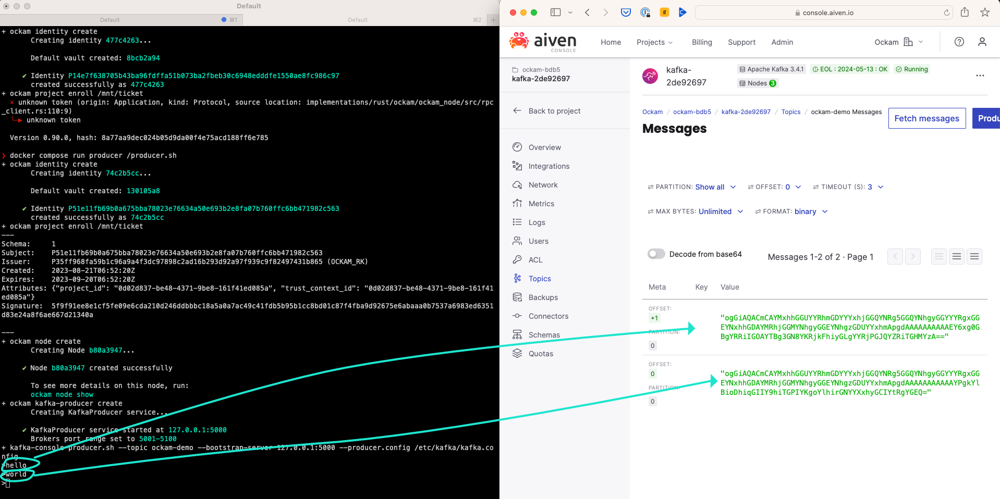

# Aiven demo: End-to-end encryption through an Aiven-managed Kafka broker

This provides a working example of send messages securely through an 
Aiven-managed kafka broker.

_But why would I want to do that?!_

A message bus can be a very convenient way to move data from one place to 
somewhere else. Sometimes that convenience means that it's tempting to send 
data that shoud be kept private (e.g., PII) via your broker. And while the 
communication to and from the broker is possibly encrypted over TLS, the 
message is now in plaintext within the broker itself. Which means anyone who
can gain access to the topic now or in the future can read the content of
all those messages. Ockam solves that, without any code changes to producers or 
consumer, and provides the following improvements:

* **Unique keys per identity:** each consumer and producer generates its own 
cryptographic keys, and is issued its own unique credentials. They then use 
these to establish a mutually trusted secure channel between each other. By 
removing the dependency on a third-party service to store or distribute keys 
you're able to reduce your vulnerability surface area and eliminate single 
points of failure.
* **Tamper-proof data transfer:** by pushing control of keys to the edges of the 
system, where authenticated encryption and decryption occurs, no other parties 
in the supply-chain are able to modify the data in transit. You can be assured 
that the data you receive at the consumer is exactly what was sent by your 
producers. You can also be assured that only authorized producers can write to a 
topic ensuring that the data in your topic is highly trustworthy. If you have 
even more stringent requirements you can take control of your credential 
authority and enforce granular authorization policies.
* **Reduced exposure window:** Ockam secure channels regularly rotate 
authentication keys and session secrets. This approach means that if one of 
those session secrets was exposed your total data exposure window is limited to 
the small duration that secret was in use. Rotating authentication keys means 
that even when the identity keys of a producer are compromised - no historical 
data is compromised. You can selectively remove the compromised producer and its 
data. With centralized shared key distribution approaches there is the risk that 
all current and historical data can’t be trusted after a breach because it may 
have been tampered with or stolen. Ockam's approach eliminates the risk of 
compromised historical data and minimizes the risk to future data using 
automatically rotating keys.

## Demo

Here's an example of the final result. The screen on the left is a producer
that sent two messages: one of `hello` and a second message of `world`. On
the right is a what is received by the Aiven-managed Kafka broker, two encrypted
messages that can not be read by the broker or anything other than the intended
consumer node.



### Requirements

* Docker (+ compose)
* [Ockam Command](https://docs.ockam.io/#install)
* [Aiven-managed Kafka cluster](https//console.aiven.io/)

### Running

Run the initial setup script, which will reset any existing Ockam setup and then
enroll you as an admin:

```console
./bin/setup
```

Then run the `up` script which will start the services and give you additional
instructions:

```console
./bin/up
```

The script will have output more instructions at the end to tell you how to:

* Tail the consumer log output to see what messages it receives
* Start an interactive producer prompt so you can send messages to the consumer
* Open the Aiven console in a browser so you can verify messages were
indeed encrypted in transit through the broker